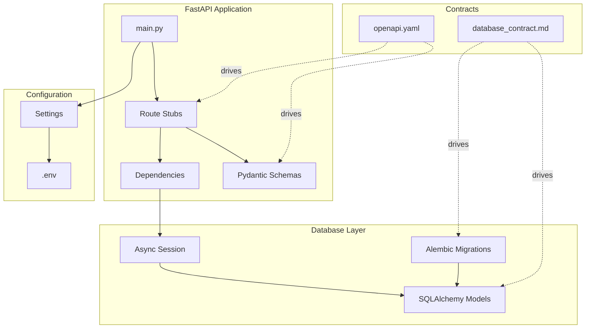

# Design Document: Backend Skeleton

## Overview

The Backend Skeleton establishes the structural foundation for Mpango ERP by proving alignment between three canonical sources of truth:
- **OpenAPI Contract** (`docs/contracts/openapi.yaml`) - API specification
- **Database Contract** (`docs/contracts/database_contract.md`) - Schema specification  
- **RBAC Matrix** (`docs/contracts/rbac_matrix.md`) - Permission definitions

This skeleton implements no business logic. It creates an executable proof that the database schema, ORM models, Pydantic schemas, and FastAPI routes are structurally aligned and ready for business logic implementation.

## Architecture



### Directory Structure

```
backend/
├── alembic/
│   ├── versions/
│   │   └── 001_initial_schema.py
│   ├── env.py
│   └── script.py.mako
├── alembic.ini
├── api/
│   ├── __init__.py
│   ├── dependencies.py
│   └── v1/
│       ├── __init__.py
│       ├── auth.py
│       ├── users.py
│       ├── roles.py
│       └── orders.py
├── core/
│   ├── __init__.py
│   ├── config.py
│   ├── exceptions.py
│   └── security.py
├── database/
│   ├── __init__.py
│   ├── base.py
│   └── session.py
├── models/
│   ├── __init__.py
│   ├── base.py
│   ├── wholesaler.py
│   ├── user.py
│   ├── role.py
│   └── permission.py
├── schemas/
│   ├── __init__.py
│   ├── common.py
│   ├── auth.py
│   ├── user.py
│   ├── role.py
│   └── order.py
├── main.py
└── requirements.txt
```

## Components and Interfaces

### 1. Configuration Module (`core/config.py`)

Manages environment-based configuration using Pydantic Settings.

```python
from pydantic_settings import BaseSettings
from functools import lru_cache

class Settings(BaseSettings):
    # Database
    DATABASE_URL: str
    DATABASE_ECHO: bool = False
    
    # Application
    APP_NAME: str = "Mpango ERP"
    DEBUG: bool = False
    
    # Security
    SECRET_KEY: str
    ACCESS_TOKEN_EXPIRE_MINUTES: int = 30
    REFRESH_TOKEN_EXPIRE_DAYS: int = 7
    
    # CORS
    CORS_ORIGINS: list[str] = ["http://localhost:3000"]
    
    class Config:
        env_file = ".env"
        case_sensitive = True

@lru_cache
def get_settings() -> Settings:
    return Settings()
```

### 2. Database Session Management (`database/session.py`)

Provides async database sessions with tenant schema support.

```python
from sqlalchemy.ext.asyncio import AsyncSession, create_async_engine, async_sessionmaker
from sqlalchemy import text
from typing import AsyncGenerator

class DatabaseSession:
    def __init__(self, database_url: str):
        self.engine = create_async_engine(database_url, echo=False)
        self.async_session = async_sessionmaker(
            self.engine, 
            class_=AsyncSession, 
            expire_on_commit=False
        )
    
    async def get_session(self, tenant_schema: str | None = None) -> AsyncGenerator[AsyncSession, None]:
        async with self.async_session() as session:
            if tenant_schema:
                await session.execute(
                    text(f'SET LOCAL search_path TO "{tenant_schema}", public')
                )
            try:
                yield session
                await session.commit()
            except Exception:
                await session.rollback()
                raise
            finally:
                await session.close()
```

### 3. SQLAlchemy Base Model (`models/base.py`)

Defines the base model with common columns for all tables.

```python
from sqlalchemy import Column, DateTime, Boolean, ForeignKey
from sqlalchemy.dialects.postgresql import UUID
from sqlalchemy.orm import DeclarativeBase, Mapped, mapped_column
from sqlalchemy.sql import func
import uuid

class Base(DeclarativeBase):
    pass

class AuditMixin:
    """Mixin for audit columns required by database_contract.md"""
    created_at: Mapped[datetime] = mapped_column(
        DateTime(timezone=True), 
        server_default=func.now(), 
        nullable=False
    )
    updated_at: Mapped[datetime] = mapped_column(
        DateTime(timezone=True), 
        server_default=func.now(), 
        onupdate=func.now(), 
        nullable=False
    )
    is_deleted: Mapped[bool] = mapped_column(
        Boolean, 
        default=False, 
        nullable=False
    )
    deleted_at: Mapped[datetime | None] = mapped_column(
        DateTime(timezone=True), 
        nullable=True
    )

class UserTrackingMixin:
    """Mixin for user tracking columns"""
    created_by: Mapped[uuid.UUID | None] = mapped_column(
        UUID(as_uuid=True), 
        ForeignKey("users.id"), 
        nullable=True
    )
    updated_by: Mapped[uuid.UUID | None] = mapped_column(
        UUID(as_uuid=True), 
        ForeignKey("users.id"), 
        nullable=True
    )
```

### 4. ORM Models

#### Wholesaler Model (Public Schema)

```python
from sqlalchemy import String, Text
from sqlalchemy.dialects.postgresql import UUID
from sqlalchemy.orm import Mapped, mapped_column
from models.base import Base, AuditMixin
import uuid

class Wholesaler(Base, AuditMixin):
    __tablename__ = "wholesalers"
    __table_args__ = {"schema": "public"}
    
    id: Mapped[uuid.UUID] = mapped_column(
        UUID(as_uuid=True), 
        primary_key=True, 
        default=uuid.uuid4,
        server_default=text("gen_random_uuid()")
    )
    code: Mapped[str] = mapped_column(
        String(32), 
        unique=True, 
        nullable=False, 
        index=True
    )
    name: Mapped[str] = mapped_column(String(255), nullable=False)
    address: Mapped[str | None] = mapped_column(Text, nullable=True)
    contact: Mapped[str | None] = mapped_column(Text, nullable=True)
    plan_type: Mapped[str | None] = mapped_column(String(50), nullable=True)
```

#### User Model (Tenant Schema)

```python
class User(Base, AuditMixin, UserTrackingMixin):
    __tablename__ = "users"
    
    id: Mapped[uuid.UUID] = mapped_column(
        UUID(as_uuid=True), 
        primary_key=True, 
        default=uuid.uuid4,
        server_default=text("gen_random_uuid()")
    )
    email: Mapped[str] = mapped_column(
        String(255), 
        unique=True, 
        nullable=False, 
        index=True
    )
    password_hash: Mapped[str] = mapped_column(String(255), nullable=False)
    full_name: Mapped[str | None] = mapped_column(Text, nullable=True)
    is_active: Mapped[bool] = mapped_column(Boolean, default=True, nullable=False)
    
    # Relationships
    roles: Mapped[list["Role"]] = relationship(
        secondary="user_roles", 
        back_populates="users"
    )
```

#### Role Model (Tenant Schema)

```python
class Role(Base, AuditMixin, UserTrackingMixin):
    __tablename__ = "roles"
    
    id: Mapped[uuid.UUID] = mapped_column(
        UUID(as_uuid=True), 
        primary_key=True, 
        default=uuid.uuid4,
        server_default=text("gen_random_uuid()")
    )
    name: Mapped[str] = mapped_column(
        String(100), 
        unique=True, 
        nullable=False
    )
    description: Mapped[str | None] = mapped_column(Text, nullable=True)
    
    # Relationships
    users: Mapped[list["User"]] = relationship(
        secondary="user_roles", 
        back_populates="roles"
    )
    permissions: Mapped[list["Permission"]] = relationship(
        secondary="role_permissions", 
        back_populates="roles"
    )
```

#### Permission Model (Tenant Schema)

```python
class Permission(Base, AuditMixin, UserTrackingMixin):
    __tablename__ = "permissions"
    
    id: Mapped[uuid.UUID] = mapped_column(
        UUID(as_uuid=True), 
        primary_key=True, 
        default=uuid.uuid4,
        server_default=text("gen_random_uuid()")
    )
    code: Mapped[str] = mapped_column(
        String(100), 
        unique=True, 
        nullable=False, 
        index=True
    )
    description: Mapped[str | None] = mapped_column(Text, nullable=True)
    
    # Relationships
    roles: Mapped[list["Role"]] = relationship(
        secondary="role_permissions", 
        back_populates="permissions"
    )
```

### 5. Association Tables

```python
from sqlalchemy import Table, Column, ForeignKey
from sqlalchemy.dialects.postgresql import UUID

user_roles = Table(
    "user_roles",
    Base.metadata,
    Column("user_id", UUID(as_uuid=True), ForeignKey("users.id", ondelete="CASCADE"), primary_key=True),
    Column("role_id", UUID(as_uuid=True), ForeignKey("roles.id", ondelete="CASCADE"), primary_key=True),
)

role_permissions = Table(
    "role_permissions",
    Base.metadata,
    Column("role_id", UUID(as_uuid=True), ForeignKey("roles.id", ondelete="CASCADE"), primary_key=True),
    Column("permission_id", UUID(as_uuid=True), ForeignKey("permissions.id", ondelete="CASCADE"), primary_key=True),
)
```

### 6. Alembic Multi-Schema Configuration (`alembic/env.py`)

```python
from alembic import context
from sqlalchemy import pool, text
from sqlalchemy.ext.asyncio import create_async_engine

def get_tenant_schema():
    """Get tenant schema from -x parameter"""
    x_args = context.get_x_argument(as_dictionary=True)
    return x_args.get("tenant_schema")

def run_migrations_online():
    tenant_schema = get_tenant_schema()
    
    connectable = create_async_engine(config.get_main_option("sqlalchemy.url"))
    
    async def do_run_migrations(connection):
        if tenant_schema:
            # Create schema if not exists
            await connection.execute(
                text(f'CREATE SCHEMA IF NOT EXISTS "{tenant_schema}"')
            )
            await connection.execute(
                text(f'SET search_path TO "{tenant_schema}", public')
            )
        
        await connection.run_sync(do_run_migrations_sync)
    
    # ... async migration execution
```

## Data Models

### Pydantic Schemas

#### Common Schemas (`schemas/common.py`)

```python
from pydantic import BaseModel
from datetime import datetime
from typing import Generic, TypeVar

T = TypeVar("T")

class Pagination(BaseModel):
    page: int
    size: int
    total: int
    pages: int

class ErrorDetail(BaseModel):
    field: str | None = None
    message: str
    meta: dict | None = None

class ErrorResponse(BaseModel):
    success: bool = False
    error: dict
    timestamp: datetime

class MessageResponse(BaseModel):
    success: bool = True
    message: str
    timestamp: datetime

class DataResponse(BaseModel, Generic[T]):
    success: bool = True
    data: T
    message: str | None = None
    timestamp: datetime
```

#### User Schemas (`schemas/user.py`)

```python
from pydantic import BaseModel, EmailStr, Field
from uuid import UUID
from datetime import datetime

class UserCreate(BaseModel):
    email: EmailStr
    password: str = Field(min_length=8)
    full_name: str | None = Field(None, max_length=100)

class UserUpdate(BaseModel):
    email: EmailStr | None = None
    full_name: str | None = Field(None, max_length=100)
    is_active: bool | None = None

class UserRead(BaseModel):
    id: UUID
    email: EmailStr
    full_name: str | None
    is_active: bool
    roles: list["RoleRead"] = []
    created_at: datetime
    updated_at: datetime
    
    class Config:
        from_attributes = True
```

#### Auth Schemas (`schemas/auth.py`)

```python
class LoginRequest(BaseModel):
    tenant_code: str = Field(min_length=1, max_length=32)
    email: EmailStr
    password: str = Field(min_length=8)

class LoginResponse(BaseModel):
    success: bool = True
    data: TokenData
    timestamp: datetime

class TokenData(BaseModel):
    access_token: str
    refresh_token: str
    token_type: str = "bearer"
    user_id: UUID
    tenant_id: UUID
    tenant_schema: str
```

### 7. FastAPI Route Stubs

#### Main Application (`main.py`)

```python
from fastapi import FastAPI
from fastapi.middleware.cors import CORSMiddleware
from fastapi.openapi.utils import get_openapi
import yaml

app = FastAPI(title="Mpango ERP API")

# Load OpenAPI spec
def custom_openapi():
    if app.openapi_schema:
        return app.openapi_schema
    with open("docs/contracts/openapi.yaml") as f:
        openapi_schema = yaml.safe_load(f)
    app.openapi_schema = openapi_schema
    return app.openapi_schema

app.openapi = custom_openapi

# CORS
app.add_middleware(
    CORSMiddleware,
    allow_origins=settings.CORS_ORIGINS,
    allow_credentials=True,
    allow_methods=["*"],
    allow_headers=["*"],
)

# Health check
@app.get("/health")
async def health_check():
    return {"status": "healthy"}

# Include routers
app.include_router(auth_router, prefix="/api/v1/auth", tags=["auth"])
app.include_router(users_router, prefix="/api/v1/users", tags=["users"])
app.include_router(roles_router, prefix="/api/v1/roles", tags=["roles"])
app.include_router(orders_router, prefix="/api/v1/orders", tags=["orders"])
```

#### Auth Routes (`api/v1/auth.py`)

```python
from fastapi import APIRouter, HTTPException
from schemas.auth import LoginRequest, LoginResponse, RefreshTokenRequest
from schemas.common import MessageResponse

router = APIRouter()

@router.post("/login", response_model=LoginResponse)
async def login(request: LoginRequest):
    """Stub: Multi-tenant login"""
    raise HTTPException(status_code=501, detail="Not implemented")

@router.post("/refresh", response_model=LoginResponse)
async def refresh_token(request: RefreshTokenRequest):
    """Stub: Refresh access token"""
    raise HTTPException(status_code=501, detail="Not implemented")

@router.post("/logout", response_model=MessageResponse)
async def logout():
    """Stub: Logout"""
    raise HTTPException(status_code=501, detail="Not implemented")

@router.get("/me")
async def get_current_user():
    """Stub: Get current user info"""
    raise HTTPException(status_code=501, detail="Not implemented")
```


## Correctness Properties

*A property is a characteristic or behavior that should hold true across all valid executions of a system—essentially, a formal statement about what the system should do. Properties serve as the bridge between human-readable specifications and machine-verifiable correctness guarantees.*

Based on the prework analysis, the following correctness properties have been identified:

### Property 1: ORM Model Structure Compliance

*For any* SQLAlchemy ORM model in the backend, it SHALL have:
- A UUID primary key column named `id` with `gen_random_uuid()` server default
- Audit columns: `created_at`, `updated_at`, `is_deleted`, `deleted_at`
- `__tablename__` explicitly defined in snake_case plural form
- Class name in PascalCase

**Validates: Requirements 1.3, 1.4, 3.2, 3.3**

### Property 2: Tenant Schema Migration Isolation

*For any* tenant schema name provided to Alembic via `-x tenant_schema=<name>`, the migration SHALL:
- Create the schema if it doesn't exist
- Apply all tenant-scoped tables to that schema only
- Not affect other tenant schemas or public schema tenant tables

**Validates: Requirements 2.3**

### Property 3: OpenAPI Route Coverage

*For any* path defined in `docs/contracts/openapi.yaml`, there SHALL exist a corresponding FastAPI route that:
- Matches the HTTP method and path pattern
- Returns a response structure compatible with the OpenAPI schema
- Returns HTTP 501 (Not Implemented) for stub endpoints

**Validates: Requirements 4.2, 4.3**

### Property 4: Pydantic Schema OpenAPI Alignment

*For any* schema defined in OpenAPI `components/schemas`, there SHALL exist a corresponding Pydantic model that:
- Has fields matching the OpenAPI schema properties
- Enforces the same validation constraints (required fields, formats, min/max)

**Validates: Requirements 5.1**

### Property 5: Password Hash Exclusion

*For any* Pydantic Read/Response schema, the `password_hash` field SHALL NOT be present, ensuring sensitive data is never exposed in API responses.

**Validates: Requirements 5.3**

### Property 6: UUID Serialization

*For any* UUID field in a Pydantic response schema, it SHALL serialize to a string representation in JSON responses.

**Validates: Requirements 5.4**

### Property 7: Request Validation

*For any* invalid request body (missing required fields, wrong types, constraint violations), the Backend_Skeleton SHALL reject the request with HTTP 422 and a structured error response.

**Validates: Requirements 5.5**

### Property 8: Tenant Schema Isolation

*For any* database session with a tenant_schema provided, the `search_path` SHALL be set to `"<tenant_schema>", public` ensuring queries resolve to the correct tenant's data.

**Validates: Requirements 6.3**

## Error Handling

### Configuration Errors

| Error Condition | Behavior |
|----------------|----------|
| Missing `DATABASE_URL` | Raise `ValidationError` at startup with message "DATABASE_URL is required" |
| Invalid `DATABASE_URL` format | Raise `ValidationError` with connection string format guidance |
| Missing `SECRET_KEY` | Raise `ValidationError` at startup |

### Database Errors

| Error Condition | Behavior |
|----------------|----------|
| Connection failure | Log error, return HTTP 503 Service Unavailable |
| Query timeout | Rollback transaction, return HTTP 504 Gateway Timeout |
| Constraint violation | Rollback transaction, return HTTP 400 with error details |
| Transaction failure | Rollback all changes, propagate exception |

### API Errors

| Error Condition | Behavior |
|----------------|----------|
| Invalid request body | Return HTTP 422 with validation error details |
| Stub endpoint called | Return HTTP 501 Not Implemented |
| Unauthorized | Return HTTP 401 with error response |
| Forbidden | Return HTTP 403 with error response |
| Not found | Return HTTP 404 with error response |

### Error Response Format

All errors follow the OpenAPI `ErrorResponse` schema:

```json
{
  "success": false,
  "error": {
    "code": "VALIDATION_ERROR",
    "message": "Input validation failed",
    "details": [
      {"field": "email", "message": "Invalid email format"}
    ]
  },
  "timestamp": "2025-01-12T10:00:00Z"
}
```

## Testing Strategy

### Testing Framework

- **Unit Tests**: pytest with pytest-asyncio
- **Property-Based Tests**: Hypothesis
- **Integration Tests**: pytest with TestClient (httpx)
- **Database Tests**: pytest with async SQLAlchemy test fixtures

### Test Configuration

```python
# pytest.ini
[pytest]
asyncio_mode = auto
testpaths = tests
python_files = test_*.py
python_functions = test_*
```

### Unit Tests

Unit tests verify specific examples and edge cases:

1. **Configuration Tests**
   - Test loading from environment variables
   - Test .env file loading
   - Test missing required config raises error
   - Test default values for optional config

2. **Model Tests**
   - Test model instantiation
   - Test column types match contract
   - Test relationships are defined

3. **Schema Tests**
   - Test Create schema validation
   - Test Update schema partial updates
   - Test Read schema excludes password_hash

### Property-Based Tests

Property tests verify universal properties across generated inputs:

1. **Property 1: ORM Model Structure** - Verify all models have required structure
2. **Property 3: Route Coverage** - Verify all OpenAPI paths have routes
3. **Property 5: Password Exclusion** - Verify no Read schema exposes password_hash
4. **Property 7: Request Validation** - Verify invalid inputs are rejected

### Integration Tests

1. **Health Check** - GET /health returns 200
2. **OpenAPI Spec** - GET /openapi.json returns valid spec
3. **CORS Headers** - Responses include CORS headers
4. **Stub Endpoints** - All endpoints return 501

### Test Annotations

Each property test must be annotated with:
```python
# Feature: backend-skeleton, Property N: <property_text>
# Validates: Requirements X.Y
```

### Minimum Iterations

Property-based tests must run minimum 100 iterations to ensure adequate coverage.
