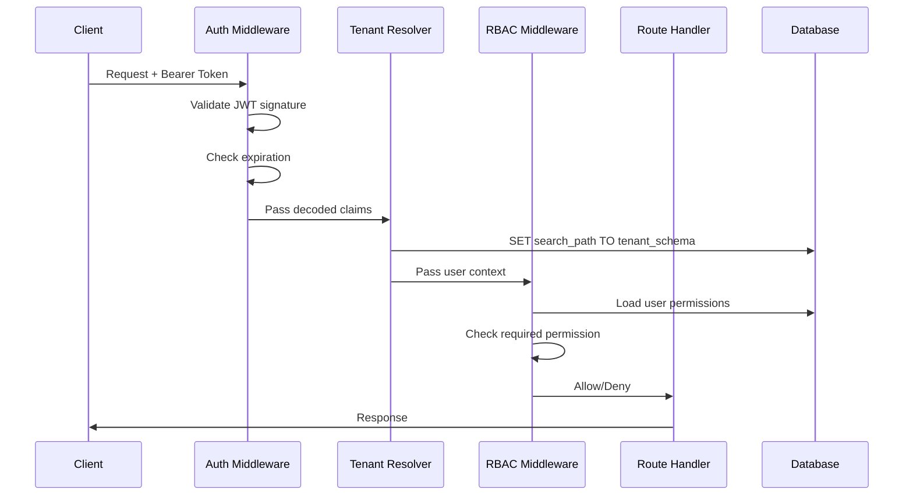

# Design Document: Identity & Security Layer

## Overview

The Identity & Security Layer provides authentication, authorization, and tenant isolation for Mpango ERP. It implements:

1. **JWT Authentication** - Token generation, validation, and refresh
2. **Tenant Resolution** - Extract tenant context from JWT, set database search_path
3. **RBAC Enforcement** - Permission-based access control per rbac_matrix.md

This layer integrates with the existing backend skeleton without modifying the OpenAPI contract.

## Architecture

```mermaid
graph TB
    subgraph "Request Flow"
        REQ[HTTP Request]
        AUTH[Auth Middleware]
        TENANT[Tenant Resolver]
        RBAC[RBAC Middleware]
        ROUTE[Route Handler]
    end
    
    subgraph "Auth Service"
        LOGIN[Login Handler]
        REFRESH[Refresh Handler]
        ME[/auth/me Handler]
        JWT[JWT Utils]
        PWD[Password Utils]
    end
    
    subgraph "Database"
        PUBLIC[(public.wholesalers)]
        TENANT_DB[(tenant.users)]
        ROLES[(tenant.roles)]
        PERMS[(tenant.permissions)]
    end
    
    REQ --> AUTH
    AUTH --> TENANT
    TENANT --> RBAC
    RBAC --> ROUTE
    
    LOGIN --> PUBLIC
    LOGIN --> TENANT_DB
    LOGIN --> JWT
    LOGIN --> PWD
    
    REFRESH --> JWT
    ME --> JWT
    
    RBAC --> ROLES
    RBAC --> PERMS
    
    TENANT --> |SET search_path| TENANT_DB
```

### Component Interactions



## Components and Interfaces

### 1. JWT Utilities (`core/security.py`)

Handles JWT token creation and validation.

```python
from datetime import datetime, timedelta
from typing import Optional
from jose import jwt, JWTError
from pydantic import BaseModel

class TokenPayload(BaseModel):
    user_id: str
    tenant_id: str
    tenant_schema: str
    exp: Optional[int] = None
    type: str = "access"  # "access" or "refresh"

def create_access_token(
    user_id: str,
    tenant_id: str,
    tenant_schema: str,
    expires_delta: timedelta = None
) -> str:
    """Create JWT access token with tenant claims."""
    expire = datetime.utcnow() + (expires_delta or timedelta(minutes=30))
    payload = {
        "user_id": user_id,
        "tenant_id": tenant_id,
        "tenant_schema": tenant_schema,
        "exp": expire,
        "type": "access"
    }
    return jwt.encode(payload, settings.SECRET_KEY, algorithm=settings.ALGORITHM)

def create_refresh_token(
    user_id: str,
    tenant_id: str,
    tenant_schema: str,
    expires_delta: timedelta = None
) -> str:
    """Create JWT refresh token."""
    expire = datetime.utcnow() + (expires_delta or timedelta(days=7))
    payload = {
        "user_id": user_id,
        "tenant_id": tenant_id,
        "tenant_schema": tenant_schema,
        "exp": expire,
        "type": "refresh"
    }
    return jwt.encode(payload, settings.SECRET_KEY, algorithm=settings.ALGORITHM)

def decode_token(token: str) -> TokenPayload:
    """Decode and validate JWT token."""
    try:
        payload = jwt.decode(token, settings.SECRET_KEY, algorithms=[settings.ALGORITHM])
        return TokenPayload(**payload)
    except JWTError as e:
        raise InvalidTokenError(str(e))
```

### 2. Password Utilities (`core/security.py`)

Handles password hashing and verification using bcrypt.

```python
from passlib.context import CryptContext

pwd_context = CryptContext(schemes=["bcrypt"], deprecated="auto")

def hash_password(password: str) -> str:
    """Hash password using bcrypt."""
    return pwd_context.hash(password)

def verify_password(plain_password: str, hashed_password: str) -> bool:
    """Verify password against hash."""
    return pwd_context.verify(plain_password, hashed_password)
```

### 3. Auth Middleware (`api/middleware/auth.py`)

Validates JWT tokens and extracts user context.

```python
from fastapi import Request, HTTPException, status
from fastapi.security import HTTPBearer, HTTPAuthorizationCredentials

class JWTBearer(HTTPBearer):
    """JWT Bearer token authentication."""
    
    async def __call__(self, request: Request) -> TokenPayload:
        credentials: HTTPAuthorizationCredentials = await super().__call__(request)
        
        if not credentials:
            raise HTTPException(
                status_code=status.HTTP_401_UNAUTHORIZED,
                detail={"code": "MISSING_TOKEN", "message": "Authorization header required"}
            )
        
        if credentials.scheme != "Bearer":
            raise HTTPException(
                status_code=status.HTTP_401_UNAUTHORIZED,
                detail={"code": "INVALID_SCHEME", "message": "Bearer scheme required"}
            )
        
        try:
            payload = decode_token(credentials.credentials)
            if payload.type != "access":
                raise HTTPException(
                    status_code=status.HTTP_401_UNAUTHORIZED,
                    detail={"code": "INVALID_TOKEN_TYPE", "message": "Access token required"}
                )
            return payload
        except ExpiredTokenError:
            raise HTTPException(
                status_code=status.HTTP_401_UNAUTHORIZED,
                detail={"code": "TOKEN_EXPIRED", "message": "Token has expired"}
            )
        except InvalidTokenError:
            raise HTTPException(
                status_code=status.HTTP_401_UNAUTHORIZED,
                detail={"code": "INVALID_TOKEN", "message": "Invalid token"}
            )
```

### 4. Tenant Resolver (`api/dependencies.py`)

Extracts tenant context from JWT and sets database search_path.

```python
from typing import AsyncGenerator
from fastapi import Depends
from sqlalchemy.ext.asyncio import AsyncSession

async def get_current_user_context(
    token: TokenPayload = Depends(JWTBearer())
) -> TokenPayload:
    """Get current user context from JWT."""
    return token

async def get_tenant_db_session(
    token: TokenPayload = Depends(get_current_user_context)
) -> AsyncGenerator[AsyncSession, None]:
    """
    Get database session with tenant search_path set.
    
    Tenant schema is ONLY derived from JWT claims - never from headers or params.
    This ensures tenant isolation cannot be bypassed.
    """
    async for session in get_tenant_db(token.tenant_schema):
        yield session
```

### 5. RBAC Middleware (`api/middleware/rbac.py`)

Enforces permission-based access control.

```python
from typing import List
from fastapi import Depends, HTTPException, status

class RequirePermission:
    """Dependency that checks user has required permission."""
    
    def __init__(self, permission: str):
        self.permission = permission
    
    async def __call__(
        self,
        token: TokenPayload = Depends(get_current_user_context),
        db: AsyncSession = Depends(get_tenant_db_session)
    ) -> TokenPayload:
        # Load user with roles and permissions
        user = await get_user_with_permissions(db, token.user_id)
        
        if not user:
            raise HTTPException(
                status_code=status.HTTP_401_UNAUTHORIZED,
                detail={"code": "USER_NOT_FOUND", "message": "User not found"}
            )
        
        # Admin role has all permissions
        if "admin" in [r.name for r in user.roles]:
            return token
        
        # Check if user has required permission
        user_permissions = set()
        for role in user.roles:
            for perm in role.permissions:
                user_permissions.add(perm.code)
        
        if self.permission not in user_permissions:
            raise HTTPException(
                status_code=status.HTTP_403_FORBIDDEN,
                detail={
                    "code": "PERMISSION_DENIED",
                    "message": f"Permission '{self.permission}' required"
                }
            )
        
        return token
```

### 6. Auth Service (`api/v1/auth.py`)

Implements authentication endpoints.

```python
@router.post("/login", response_model=LoginResponse)
async def login(request: LoginRequest, db: AsyncSession = Depends(get_db_session)):
    """
    Multi-tenant login flow:
    1. Validate tenant_code against public.wholesalers
    2. Derive tenant_schema from wholesaler.id
    3. Authenticate user in tenant schema
    4. Return JWT with tenant claims
    """
    # 1. Find wholesaler by tenant_code
    wholesaler = await get_wholesaler_by_code(db, request.tenant_code)
    if not wholesaler:
        raise HTTPException(
            status_code=status.HTTP_404_NOT_FOUND,
            detail={"code": "TENANT_NOT_FOUND", "message": "Tenant not found"}
        )
    
    tenant_schema = wholesaler.get_tenant_schema()
    
    # 2. Switch to tenant schema and find user
    async for tenant_db in get_tenant_db(tenant_schema):
        user = await get_user_by_email(tenant_db, request.email)
        
        if not user:
            raise HTTPException(
                status_code=status.HTTP_401_UNAUTHORIZED,
                detail={"code": "INVALID_CREDENTIALS", "message": "Invalid credentials"}
            )
        
        if not user.is_active:
            raise HTTPException(
                status_code=status.HTTP_400_BAD_REQUEST,
                detail={"code": "USER_INACTIVE", "message": "User account is inactive"}
            )
        
        # 3. Verify password
        if not verify_password(request.password, user.password_hash):
            raise HTTPException(
                status_code=status.HTTP_401_UNAUTHORIZED,
                detail={"code": "INVALID_CREDENTIALS", "message": "Invalid credentials"}
            )
        
        # 4. Generate tokens
        access_token = create_access_token(
            user_id=str(user.id),
            tenant_id=str(wholesaler.id),
            tenant_schema=tenant_schema
        )
        refresh_token = create_refresh_token(
            user_id=str(user.id),
            tenant_id=str(wholesaler.id),
            tenant_schema=tenant_schema
        )
        
        return LoginResponse(
            success=True,
            data=TokenData(
                access_token=access_token,
                refresh_token=refresh_token,
                token_type="bearer",
                user_id=str(user.id),
                tenant_id=str(wholesaler.id),
                tenant_schema=tenant_schema
            ),
            timestamp=datetime.utcnow()
        )

@router.get("/me", response_model=CurrentUserResponse)
async def get_current_user(
    token: TokenPayload = Depends(get_current_user_context),
    db: AsyncSession = Depends(get_tenant_db_session)
):
    """Get current authenticated user info from token."""
    user = await get_user_with_permissions(db, token.user_id)
    
    if not user:
        raise HTTPException(
            status_code=status.HTTP_401_UNAUTHORIZED,
            detail={"code": "USER_NOT_FOUND", "message": "User not found"}
        )
    
    # Extract role names and permission codes
    roles = [role.name for role in user.roles]
    permissions = set()
    for role in user.roles:
        for perm in role.permissions:
            permissions.add(perm.code)
    
    return CurrentUserResponse(
        success=True,
        data=CurrentUserData(
            id=str(user.id),
            email=user.email,
            full_name=user.full_name,
            tenant_id=token.tenant_id,
            tenant_schema=token.tenant_schema,
            roles=roles,
            permissions=list(permissions)
        ),
        timestamp=datetime.utcnow()
    )
```

## Data Models

### Token Payload Structure

```python
class TokenPayload(BaseModel):
    """JWT token payload per multi_tenancy_spec.md section 4.1"""
    user_id: str      # UUID as string
    tenant_id: str    # UUID as string
    tenant_schema: str  # e.g., "t_abc123..."
    exp: int          # Expiration timestamp
    type: str         # "access" or "refresh"
```

### User with Permissions

```python
class UserWithPermissions:
    """User model with loaded roles and permissions."""
    id: UUID
    email: str
    full_name: str | None
    is_active: bool
    password_hash: str
    roles: List[Role]  # Each role has permissions loaded
```

### Endpoint Permission Map

Per openapi.yaml and rbac_matrix.md:

| Endpoint | Method | Permission |
|----------|--------|------------|
| /users | GET | users:read |
| /users | POST | users:create |
| /users/{id} | GET | users:read |
| /users/{id} | PUT | users:update |
| /users/{id} | DELETE | users:deactivate |
| /users/{id}/roles | PUT | roles:assign |
| /roles | GET | roles:read |
| /orders | GET | orders:read |
| /orders | POST | orders:create |
| /orders/{id} | GET | orders:read |
| /orders/{id}/confirm | POST | orders:confirm |
| /orders/{id}/ship | POST | orders:ship |
| /orders/{id}/cancel | POST | orders:cancel |


## Correctness Properties

These properties must hold for the security layer to be correct:

### P1: Token Integrity
- **Property**: A token created with `create_access_token(user_id, tenant_id, tenant_schema)` MUST decode to the same values
- **Test**: Property-based test with arbitrary UUIDs and schema names

### P2: Token Expiration
- **Property**: A token with `exp < now()` MUST raise `ExpiredTokenError` on decode
- **Test**: Create token with past expiration, verify decode fails

### P3: Tenant Isolation
- **Property**: `tenant_schema` in database session MUST equal `tenant_schema` from JWT claims
- **Test**: Verify search_path matches JWT claim, never from headers/params

### P4: RBAC Enforcement
- **Property**: User without permission P MUST receive 403 when accessing endpoint requiring P
- **Test**: Create user without permission, verify 403 response

### P5: Admin Bypass
- **Property**: User with "admin" role MUST pass all permission checks
- **Test**: Admin user can access any endpoint regardless of specific permissions

### P6: Password Security
- **Property**: `verify_password(plain, hash_password(plain))` MUST return True
- **Property**: `verify_password(wrong, hash_password(plain))` MUST return False
- **Test**: Property-based test with arbitrary passwords

### P7: Token Type Separation
- **Property**: Access token MUST NOT be accepted as refresh token and vice versa
- **Test**: Use access token in refresh endpoint, verify rejection

### P8: Claim Immutability
- **Property**: Refreshed tokens MUST preserve original tenant_id and tenant_schema
- **Test**: Refresh token, verify claims match original

## Error Handling

### HTTP 401 Unauthorized

| Error Code | Condition | Message |
|------------|-----------|---------|
| MISSING_TOKEN | No Authorization header | Authorization header required |
| INVALID_TOKEN | JWT signature invalid | Invalid token |
| TOKEN_EXPIRED | JWT exp < now | Token has expired |
| INVALID_TOKEN_TYPE | Wrong token type (access vs refresh) | Access token required |
| INVALID_REFRESH_TOKEN | Refresh token invalid | Invalid refresh token |
| REFRESH_TOKEN_EXPIRED | Refresh token exp < now | Refresh token has expired |
| INVALID_CREDENTIALS | Wrong email or password | Invalid credentials |
| USER_NOT_FOUND | User ID from token not in DB | User not found |

### HTTP 403 Forbidden

| Error Code | Condition | Message |
|------------|-----------|---------|
| PERMISSION_DENIED | User lacks required permission | Permission '{code}' required |

### HTTP 400 Bad Request

| Error Code | Condition | Message |
|------------|-----------|---------|
| USER_INACTIVE | User is_active = false | User account is inactive |

### HTTP 404 Not Found

| Error Code | Condition | Message |
|------------|-----------|---------|
| TENANT_NOT_FOUND | tenant_code not in wholesalers | Tenant not found |

## Testing Strategy

### Unit Tests

1. **JWT Utilities** (`test_jwt_utils.py`)
   - Token creation with valid claims
   - Token decode with valid token
   - Token decode with expired token (expect error)
   - Token decode with invalid signature (expect error)
   - Token type validation (access vs refresh)

2. **Password Utilities** (`test_password_utils.py`)
   - Password hashing produces different hash each time (salt)
   - Password verification with correct password
   - Password verification with wrong password

### Integration Tests

3. **Auth Endpoints** (`test_auth_endpoints.py`)
   - Login with valid credentials → 200 + tokens
   - Login with invalid tenant_code → 404
   - Login with invalid email → 401
   - Login with invalid password → 401
   - Login with inactive user → 400
   - Refresh with valid token → 200 + new tokens
   - Refresh with expired token → 401
   - Refresh with access token → 401
   - GET /auth/me with valid token → 200 + user data
   - GET /auth/me without token → 401

4. **Tenant Isolation** (`test_tenant_isolation_security.py`)
   - Request with JWT sets correct search_path
   - Cannot override tenant_schema via header
   - Different JWT → different search_path

5. **RBAC Enforcement** (`test_rbac_enforcement.py`)
   - User with permission → 200
   - User without permission → 403
   - Admin user → 200 (bypass)
   - Permission check loads from role_permissions

### Property-Based Tests (Hypothesis)

6. **Token Properties** (`test_token_properties.py`)
   - P1: Token roundtrip integrity
   - P6: Password hash/verify roundtrip
   - P8: Refresh preserves claims

## File Structure

```
backend/
├── core/
│   └── security.py          # JWT + password utilities
├── api/
│   ├── middleware/
│   │   ├── __init__.py
│   │   ├── auth.py          # JWTBearer dependency
│   │   └── rbac.py          # RequirePermission dependency
│   ├── dependencies.py      # Updated with tenant resolver
│   └── v1/
│       ├── auth.py          # Updated with real implementations
│       ├── users.py         # Updated with RBAC dependencies
│       ├── roles.py         # Updated with RBAC dependencies
│       └── orders.py        # Updated with RBAC dependencies
├── crud/
│   ├── __init__.py
│   ├── user.py              # User CRUD with permissions
│   └── wholesaler.py        # Wholesaler lookup
└── tests/
    ├── test_jwt_utils.py
    ├── test_password_utils.py
    ├── test_auth_endpoints.py
    ├── test_tenant_isolation_security.py
    ├── test_rbac_enforcement.py
    └── test_token_properties.py
```
