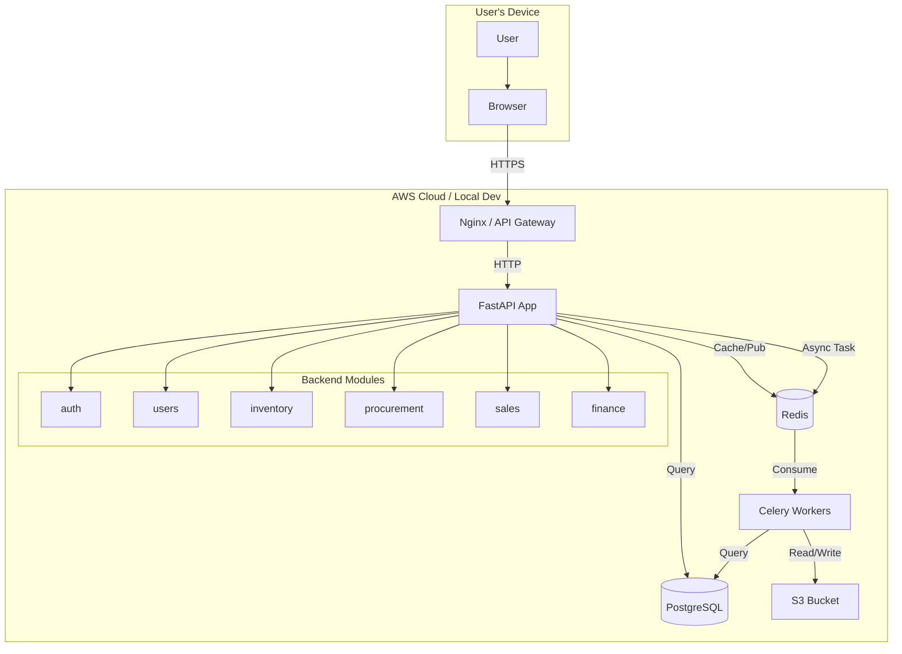

# Mpango ERP — Architecture Contract
**Version:** 1.1
**Purpose:** 定义帝国的技术蓝图、演进路径与 AI 原生设计原则。
**Last Updated:** 2025-06-10

## 1. 愿景与目标

我们的架构演进遵循一条清晰的路径：从一个健壮的模块化单体，走向云原生的微服务，最终实现一个由 AI Agent 驱动的、自我优化的智能系统。

“MVP 采用 Schema-per-tenant（每个 Wholesaler 一个 schema）”

“Tenant resolution from JWT claims: tenant_id, tenant_schema”

“DB session uses SET LOCAL search_path TO <tenant_schema>, public”

“Provisioning steps（建 schema、跑 migrations、seed RBAC）”

- **当前阶段**: 构建一个**模块化单体**，快速验证业务，同时为微服务拆分做好准备。
- **下一阶段**: 拆分为**云原生微服务**，实现独立部署、扩缩容和技术栈多样化。
- **最终愿景**: 迈向**AI Agent 化架构**，业务功能由可组合的 AI Agent 实现，系统具备自主决策和演进能力。

---

## 2. 当前阶段：模块化单体

此阶段的核心是**速度与纪律**。我们将所有功能部署在一个单元中，但内部严格按模块划分。

### 2.1. 核心技术栈
- **Frontend**: React SPA, served by Nginx.
- **Backend**: FastAPI (Python 3.11+).
- **Database**: PostgreSQL 15+ (as defined in `kiro_database_contract.md`).
- **Cache & Broker**: Redis (用于缓存和异步任务).
- **Task Queue**: Celery (基于 Redis).
- **File Storage**: Amazon S3 (使用 boto3 SDK).
- **Containerization**: Docker & Docker Compose.

### 2.2. 核心模块划分
所有后端代码必须按以下**业务领域**进行模块化组织：
- `auth`: 用户认证、JWT、权限。
- `users`: 用户、角色、权限管理 (RBAC)。
- `inventory`: 库存管理、产品、仓库。
- `procurement`: 采购订单、供应商管理。
- `sales`: 销售订单、客户管理 (CRM).
- `finance`: 财务、账单、支付。
- `core`: 共享工具、异常处理、数据库基类。

### 2.3. 通信模式
- **Frontend ↔ Backend**: HTTP/1.1 REST API (`/api/v1/*`) + JWT.
- **Backend ↔ Backend (Internal)**: 直接 Python 函数调用。
- **Asynchronous Tasks**: Backend → Redis → Celery Worker → Backend.

---

## 3. 下一阶段：云原生微服务化

当单体达到规模瓶颈时，我们将按模块拆分为独立的微服务。

### 3.1. 目标技术栈
- **Container Orchestration**: AWS Fargate (with ECS).
- **Service Discovery**: AWS Cloud Map.
- **API Gateway**: Amazon API Gateway (REST & HTTP APIs).
- **Inter-Service Communication**: Synchronous (HTTP), Asynchronous (Amazon SQS/SNS).
- **Database**: Amazon Aurora Serverless v2 (每个服务独立的 schema 或数据库实例).

### 3.2. 拆分原则
- **按业务能力**: 每个 Core Module 成为一个独立的微服务。
- **数据隔离**: 每个微服务拥有自己的数据库。
- **去中心化治理**: 每个团队可以选择最适合其业务的技术栈（在 AWS 范围内）。

---

## 4. 最终愿景：AI Agent 化架构

这是 re:Invent 2025 为我们揭示的终极形态。

### 4.1. 核心组件
- **Agent Runtime**: **Amazon Bedrock Agent Runtime** 作为系统的“大脑”，负责接收、解析和调度用户意图。
- **业务 Agents**: 每个业务模块（如 `inventory`, `procurement`）都将被一个或多个 **Bedrock Agent** 所取代或增强。
- **工具与行动**: Agent 通过调用 API、查询数据库、执行 Lambda 函数等“工具”来完成具体任务。
- **自主编排**: 多个 Agent 可以协同工作，自主完成复杂的业务流程（如“自动生成采购建议并创建订单”）。

### 4.2. 工作流示例
1.  **用户**: "帮我检查一下 A 产品的库存，如果低于 100，就创建一个采购订单。"
2.  **Bedrock Agent Runtime**: 解析意图，识别出两个任务：`check_inventory` 和 `create_purchase_order`。
3.  **调用 `Inventory Agent`**: 执行 `check_inventory` 任务。
4.  **调用 `Procurement Agent`**: 如果库存不足，执行 `create_purchase_order` 任务。
5.  **系统**: 整个过程无需人工干预，自动完成。

---

## 5. 跨领域关注点

这些关注点必须贯穿所有架构阶段。

### 5.1. Security
- **传输**: 强制 HTTPS (TLS 1.2+).
- **认证**: JWT with short-lived access tokens + refresh tokens.
- **授权**: 强制执行 RBAC (as defined in `kiro_database_contract.md`).
- **密钥管理**: 使用 AWS Secrets Manager 或 GitHub Secrets，严禁硬编码。

### 5.2. Observability
- **Logging**: 结构化 JSON logs → stdout → AWS CloudWatch Logs.
- **Metrics**: AWS CloudWatch Custom Metrics (业务指标) + Container Insights (基础指标).
- **Tracing**: AWS X-Ray (用于微服务阶段的分布式追踪).

### 5.3. Multi-Tenancy
- MVP阶段选择 Schema-per-tenant + 运行时机制
 MVP Multi-Tenancy Decision (Executable)
- MVP uses **Schema-per-tenant** (one Wholesaler == one tenant schema).
- Tenant registry is stored in `public.wholesalers` with `wholesalers.code` as tenant_code.
- Tenant is resolved during login: tenant_code -> tenant_id -> tenant_schema.
- Every authenticated request MUST derive tenant from JWT claims (tenant_id, tenant_schema).
- DB access MUST set search_path per request/transaction:
  - `SET LOCAL search_path TO "<tenant_schema>", public;`
- Tenant provisioning flow:
  1) Create wholesaler in public schema.
  2) Create tenant schema.
  3) Run Alembic migrations for that schema.
  4) Seed RBAC (roles/permissions/mappings) and create first admin user.

---

## 6. 附录：当前阶段架构图

---

## 7. Changelog

### v1.1 (2025-06-10)
- **战略重构**: 将静态架构描述升级为包含“当前”、“下一阶段”、“最终愿景”的动态演进蓝图。
- **AI 原生**: 引入 `Amazon Bedrock Agent Runtime` 作为最终愿景的核心组件。
- **聚焦 AWS**: 明确了微服务阶段的技术栈为 AWS Fargate, Aurora Serverless v2 等。
- **模块具象化**: 明确划分了 `auth`, `inventory`, `procurement` 等核心业务模块。
- **可视化**: 增加了当前阶段的 Mermaid 架构图。

### v1.0 (2025-06-10)
- Initial draft with basic monolith components.
