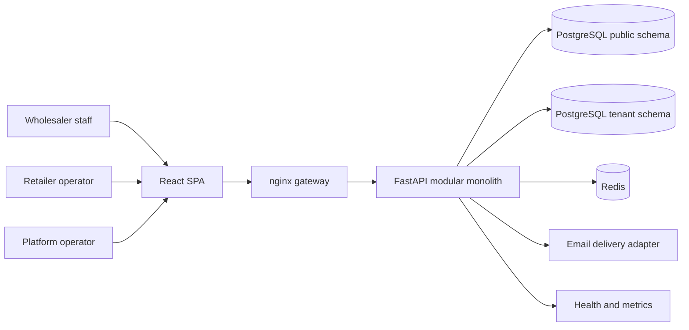

# Mpango ERP - Start Here

This is the canonical first page for people and AI agents joining Mpango ERP.
It separates the merged product, in-flight candidates, design targets, and
runtime evidence so that a commit SHA is never mistaken for a product status.

## Current truth in 60 seconds

| Item | Current snapshot (2026-09-02 +08:00) |
|---|---|
| Protected product branch | `origin/product-dev-recovered` |
| Merged baseline | `24a28d76d6d9483d8101f8e0f537c148dc262859` |
| Alembic head in that baseline | `037_payment_declarations_schema` |
| Delivery status | Pre-pilot hardening; not approved for customer delivery |
| H2-C retailer recovery | Candidate and Kilo report exist; not merged and no accepted browser authority yet |
| SKU three-layer catalog | Candidate-fix line exists; not merged into the protected product baseline |
| Pricing / order-price work | Frozen until H2-C and SKU have separate accepted merges |

The machine-readable snapshot is [docs/current/state.json](docs/current/state.json).
Before relying on it, run:

```powershell
pwsh -File scripts/project-context.ps1 -Refresh
```

`-Refresh` fetches remote refs but does not modify source files. A mismatch is a
signal to stop and update current-truth documentation, not to silently work from
an older SHA.

## What Mpango is

Mpango is a multi-tenant wholesale-retail ERP. The wholesaler owns a tenant and
operates catalog, inventory, orders, payments, finance, users, and retailer
relationships. A retailer works inside one supplier relationship at a time.
Mpango is not a cross-supplier marketplace.



The public schema holds global identity and relationship control-plane data.
Each wholesaler has a derived tenant schema for business data. Authentication
and authorization derive tenant context from verified identity and claims;
callers do not select arbitrary schemas through request parameters.

## Product surfaces

| Surface | Primary user | Boundary |
|---|---|---|
| `/login`, wholesaler ERP routes | Wholesaler staff | Tenant JWT plus RBAC permissions |
| `/retail/login?w=<CODE>`, `/client/**` | Retailer operator | Supplier-scoped retailer identity and client permissions |
| `/signup`, `/verify-email`, `/invite` | Public onboarding | Token lifecycle and neutral public responses |
| `/platform/**` | Platform operator | Platform identity; many control-plane screens are records/views, not automatic executors |
| `/healthz`, `/readyz`, `/metrics` | Operations | Runtime health and Prometheus-compatible metrics |

## Data and business shape

The merged baseline currently uses tenant-local `SKU` records, inventory stock,
movements/reservations, orders with immutable item snapshots, payment records,
declarations, receivables, and ledger entries. The proposed three-layer catalog
(`CatalogProduct -> SellableUnit -> CatalogOffer`) belongs to the unmerged SKU
line and must not be described as current baseline behavior.

See:

- [Architecture overview](docs/architecture/OVERVIEW.md)
- [Data ownership map](docs/architecture/DATA-MAP.md)
- [Core product flows](docs/architecture/FLOWS.md)
- [Current product and work status](docs/current/STATE.md)

## First ten minutes for a new contributor

1. Read this page; if a local `AGENTS.md` exists, follow its tool instructions.
2. Run `pwsh -File scripts/project-context.ps1 -Refresh -IncludeWorktrees`.
3. Confirm the live protected tip and the task's declared base SHA.
4. Create a clean isolated worktree under the approved workspace root.
5. Declare `verification_tier` and `claim_ceiling` before tests or runtime work.
6. Read the relevant contract and current-state links, not every historical branch.
7. Use GitNexus in the target worktree before changing code symbols.
8. Stop on preflight failure; an invalid environment is not product evidence.

## Evidence vocabulary

| Evidence | What it can prove |
|---|---|
| Candidate-provided | The implementation author ran a stated gate |
| Kilo independent source/test review | Scope, code, test, mutation, and evidence authenticity |
| Lubuntu independent runtime authority | Fresh-host runtime behavior at an exact candidate SHA |
| Controlled merge evidence | The reviewed tree was integrated without byte drift |
| Deployment evidence | An exact merged SHA is running in a named environment |

A full-suite zero-red result and test coverage of new code paths are separate
requirements. Every implementation report must include a `TEST_COVERAGE_DELTA`
mapping new or changed behavior to exact tests and falsification evidence.

## Operations and safety

- [Operations and incident runbook](docs/operations/RUNBOOK.md)
- [Evidence and verification policy](docs/governance/EVIDENCE.md)
- [Active work index](docs/navigation/ACTIVE-WORK.md)
- [Workspace hygiene policy](docs/navigation/WORKSPACE-HYGIENE.md)

Prometheus scraping exists in the repository, but alert rules and Alertmanager
delivery are not configured in the merged baseline. Treat monitoring, backup
restore drills, rollback drills, and customer incident response as release
readiness work that requires independent evidence.

## Truth hierarchy

When documents disagree, use this order:

1. Live remote ref plus committed source bytes.
2. `docs/current/state.json` after live-ref verification.
3. Accepted controlled-merge and independent evidence reports.
4. Architecture/contracts describing the merged baseline.
5. Planning documents, historical ledgers, and old branch reports.

Historical reports are append-only evidence, not a navigation system. Do not
infer current status from the newest-looking SHA or from the number of branches.
