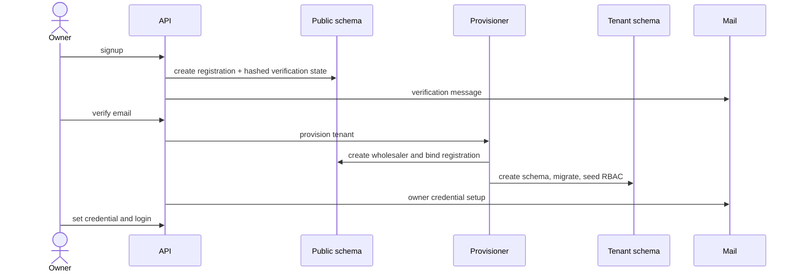
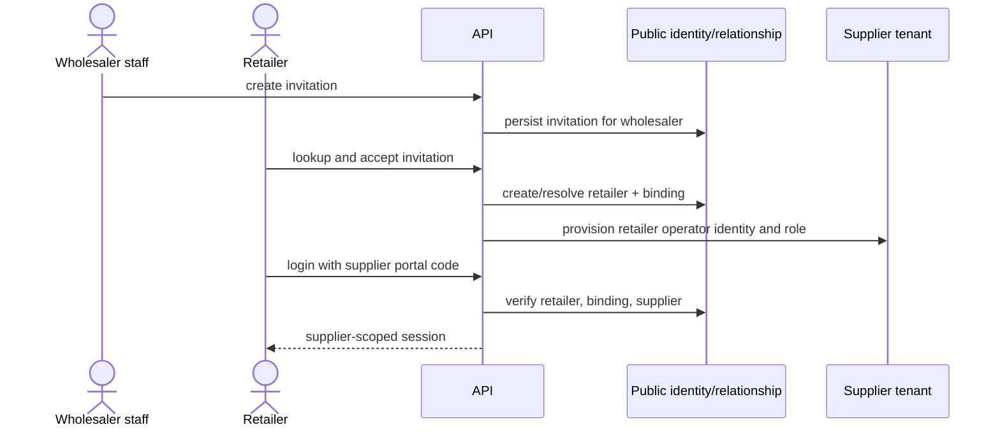
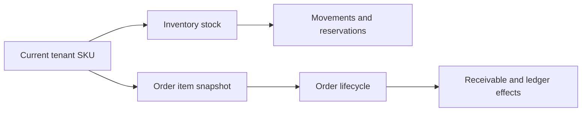

# Core Product Flows

These flows describe the merged baseline unless explicitly labeled in-flight.

## 1. Wholesaler onboarding



The provisioning lifecycle must be explicit and recoverable. A failed preflight
or incomplete schema is not a successful tenant.

## 2. Retailer invitation and supplier-scoped access



A retailer can have multiple supplier relationships, but each session selects
one verified supplier portal. The product does not expose a cross-supplier price
comparison workspace.

## 3. Credential recovery

- Wholesaler and retailer recovery are separate contracts.
- Public forgot-password responses remain neutral for existing, unknown, and
  wrong-supplier identities.
- Reset/setup secrets travel in fragments or request bodies according to the
  applicable contract, are scrubbed from the browser location, and are never
  stored in logs or report artifacts.
- H2-B wholesaler recovery is merged. H2-C retailer recovery remains unmerged at
  the current product baseline.

## 4. Catalog, inventory, and orders



Current order items retain immutable name/code/price/quantity/subtotal snapshots.
The in-flight SKU three-layer identity is not part of this baseline flow.

Order state transitions are financially sensitive. New work must reconcile the
domain state policy and CRUD/service behavior rather than treating either one as
implicitly authoritative.

## 5. Retailer order and payment declaration

1. Retailer reads a supplier-scoped catalog.
2. Retailer creates an order in that supplier relationship.
3. Supplier-side workflow confirms and fulfills according to permissions and
   inventory rules.
4. Retailer may submit a non-authoritative payment declaration.
5. Supplier cashier confirms or rejects the declaration.
6. Only confirmation invokes the canonical payment/receivable/ledger write path.
7. Retailer payment history, balance, statements, print views, and receipts are
   relationship-scoped read projections.

## 6. Platform operations

The platform surface exposes tenant health, audit, support, registry, controlled
action requests, approvals, operator tasks, and incident/runbook closeout views.
Several of these surfaces intentionally record or validate intent but do not
execute infrastructure changes. Documentation must preserve the distinction:

```text
view != execute
request != approve
approval != deployment
runbook pointer != automatic repair
```

## 7. Engineering evidence flow


- Candidate tests are author-provided evidence.
- Kilo verifies scope and test authenticity without claiming runtime it did not run.
- Lubuntu proves fresh-host behavior at the exact candidate SHA.
- Merge proof binds the reviewed tree to the protected branch.
- Deployment proof is still required after merge.
