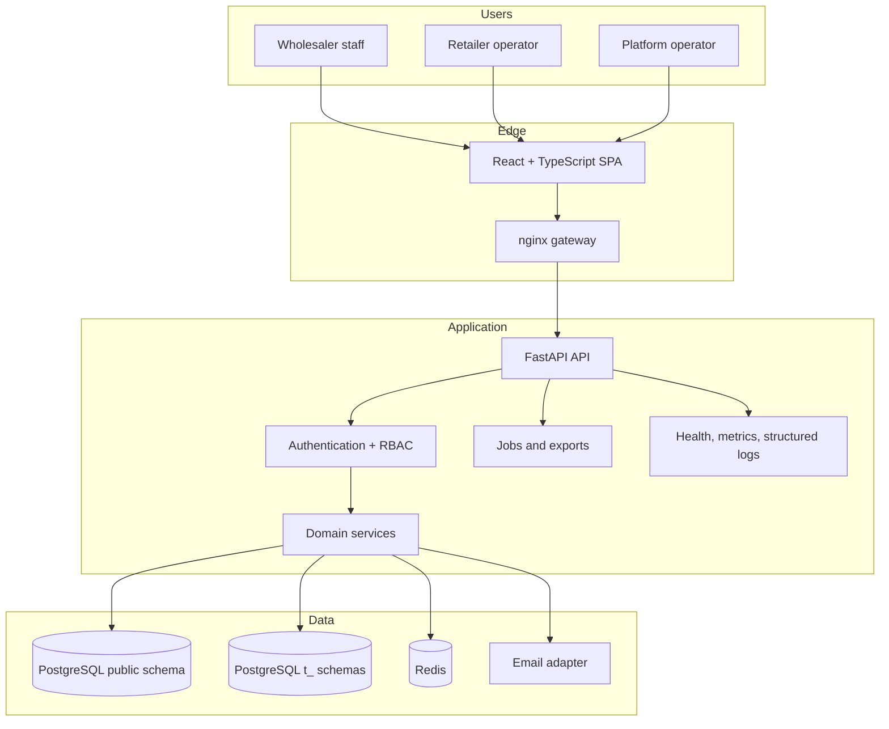
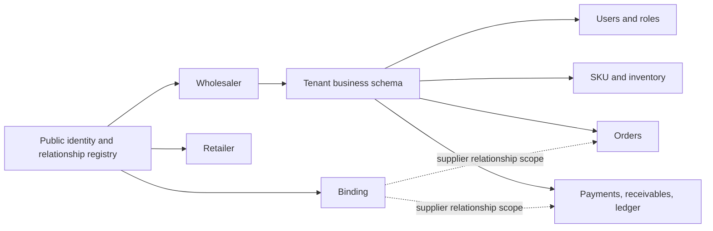

# Mpango ERP Architecture Overview

## 1. System shape

Mpango is a modular monolith with three user-facing surfaces and a shared
multi-tenant data layer:



The repository deploys this as containers for PostgreSQL, Redis, backend,
frontend, nginx gateway, and an optional Prometheus profile. The repository also
contains Kubernetes and platform-operations assets, but their presence does not
prove that a customer environment is deployed or monitored.

## 2. User and trust boundaries

| Actor | Frontend area | Server boundary |
|---|---|---|
| Wholesaler staff | ERP routes such as orders, inventory, SKU, finance | Tenant identity plus RBAC permission checks |
| Retailer operator | `/retail/login` and `/client/**` | Retailer identity bound to one wholesaler relationship |
| Public onboarding user | signup, verification, invitation, credential recovery | Short-lived token lifecycle, neutral public responses, no existing session requirement |
| Platform operator | `/platform/**` | Separate platform identity and platform-only route guards |

The system is designed so tenant context is derived from authenticated server
state and verified claims. Isolation is a security invariant backed by tests and
runtime gates; it should not be described as mathematically impossible.

## 3. Backend composition

`backend/api/app.py` assembles the FastAPI application. Routes are grouped by
business capability while services own transaction and domain behavior.

| Capability | Main source areas |
|---|---|
| Authentication and onboarding | `backend/api/v1/auth.py`, `backend/services/onboarding_service.py`, `backend/services/tenant_provisioning_service.py` |
| Users and RBAC | `backend/api/v1/users.py`, `backend/api/v1/roles.py`, `backend/models/user.py` |
| Retailer relationship | invitations, retailers, bindings, retailer provisioning and credentials |
| Catalog and inventory | SKU, intake/import, inventory stock, movements, reservations |
| Orders | order routes, order service, state policy, immutable order-item snapshots |
| Payments and finance | payment service, canonical payment service, declarations, receivables, ledger and statements |
| Platform operations | platform tenants/audit plus P10-P24 operator and incident views/contracts |
| Reporting and exports | dashboards, reports, BI assets, streaming/job exports |

SQLAlchemy models without an explicit schema are resolved in the active tenant
schema through the request/session context. Global identity and relationship
models explicitly target `public`.

## 4. Frontend composition

`frontend/src/router/AppRouter.tsx` is the route map. It separates:

- public onboarding and authentication;
- wholesaler ERP routes behind `ProtectedRoute` and `WholesalerRoute`;
- retailer routes behind `RetailerRoute` and client permission guards;
- platform operations behind `PlatformRoute`.

`frontend/src/services/api.ts` is the shared Axios boundary. It injects access
tokens, serializes refreshes, and offers `skipAuthInterceptors` for intentionally
anonymous credential flows so public 401 responses cannot refresh or terminate
an unrelated session.

## 5. Data ownership



See [DATA-MAP.md](DATA-MAP.md) for table families and cross-boundary rules.

## 6. Current catalog boundary

The merged product baseline has one tenant-local `SKU` master record per
sellable code. Inventory and order snapshots refer to that existing model.

The in-flight SKU line proposes:

```text
CatalogProduct -> SellableUnit -> CatalogOffer boundary
```

That model, migration `038`, product-level multi-packaging UX, and stable order
line UUID are not part of the protected baseline until independently reviewed
and merged. Pricing and reorder work must not assume them early.

## 7. Runtime and operations

| Signal | Baseline source | Current limitation |
|---|---|---|
| Liveness/readiness | `/healthz`, `/readyz` and health router | Must be checked in the actual deployment |
| Metrics | `/metrics`, optional Prometheus profile | No committed alert rules or Alertmanager target |
| Logging | structured logging and request context modules | Customer log aggregation/delivery is not proven here |
| Backup/restore | contracts and platform status/control records | A current independent restore drill is still required |
| Incident closeout | platform P24 contracts and UI | Records and guides work; it is not an automatic repair executor |

Use [the operations runbook](../operations/RUNBOOK.md) for response and rollback
decisions.

## 8. Engineering authority is separate from product runtime

`harness-governance/` and standalone browser harnesses enforce how evidence is
created. They are not product services. A governance PASS can approve the
authenticity of a test path without proving customer runtime behavior.

The normal evidence chain is:

```text
bounded implementation -> independent source/test review
-> independent fresh runtime -> controlled merge -> deployment evidence
```

Each step keeps its own claim ceiling.

## 9. Source-of-truth pointers

- Application assembly: `backend/api/app.py`
- Tenant session/context: `backend/database/session.py`, `backend/api/context/tenant.py`
- Models: `backend/models/`
- Frontend route map: `frontend/src/router/AppRouter.tsx`
- Shared frontend API boundary: `frontend/src/services/api.ts`
- Deployment composition: `docker-compose.yml`, `nginx/gateway.conf`
- Contract authority and lifecycle index: `docs/contracts/README.md`
- RBAC contract entry: `docs/contracts/rbac_matrix.md`
- Current state: `docs/current/STATE.md`
- Historical decisions: `decision-register/`, `ai-ledger/`

This overview describes committed baseline architecture. Planning documents and
unmerged branches are deliberately excluded unless labeled as in-flight.
